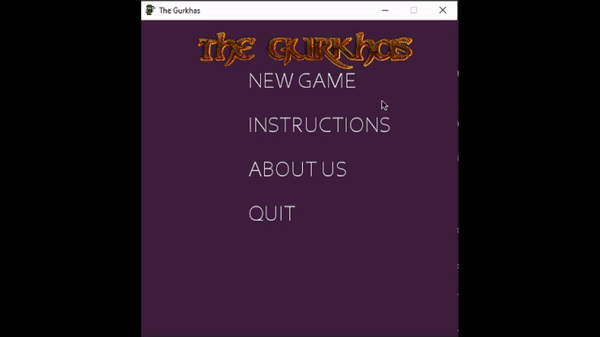

# TheGurkhas
The Gurkhas is a creative arcade game built with pygame. It was inspired from border disputes. The goal of the player is to avoid enemies from  crossing the border and also protect the border pillar. 

# Game demo

